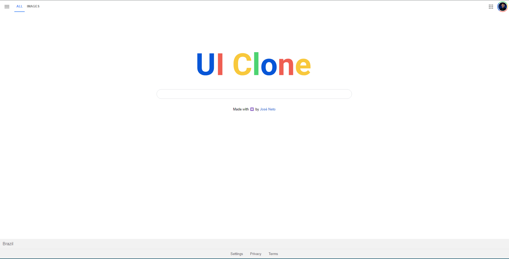
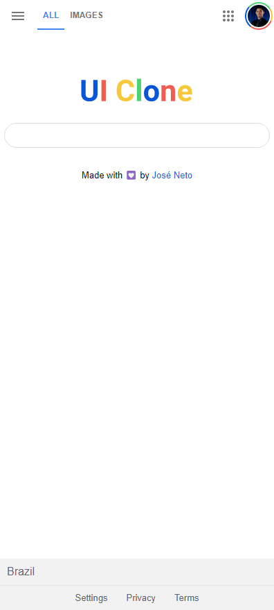

<h1 align="center">Google UI Clone</h1>

<p align="center">
 <a href="#description">Description</a> •
 <a href="#requirements">Requirements</a> • 
 <a href="#author">Author</a>
</p>

<h4 align="center"> 
	✅  Website 🚀 Finished...  ✅
</h4>

Description
=======================
<p align="center">A responsive Google UI Clone </p>

<a href="https://developer.mozilla.org/pt-BR/docs/Web/HTML">
      
</a>
<a href="https://developer.mozilla.org/pt-BR/docs/Web/CSS">
    
</a>
<a href="https://developer.mozilla.org/pt-BR/docs/Web/JavaScript">
    
</a>
<p></p>

## Preview
<p align="center">
  
  
</p>

Requirements
=======================
Before starting, you must have installed the following tools on your machine: [GIT](https://git-scm.com/downloads). Also it's nice to have an editor to work with the code like [VSCode](https://code.visualstudio.com/) with Live Server Extension.

```bash
# Clone this repository
$ git clone https://github.com/J-Neto/google-ui-clone.git

# Access project's folder in terminal/cmd
$ cd google-ui-clone

# Open the code in the editor
$ code .
or manually open via file explorer by mouse right clicking or by VSCode on the path "File > Open Folder > [Find the folder "google-ui-clone"] > Open"

# Run
$ right-click on "index.html" and select "open with live server"
```

Author
=======================
<a href="https://https://github.com/J-Neto"><br><p><b>José Neto</b> 👽</p></a><br>

Made with ❤️ by José Neto 👋🏽 Get in touch!

<a href="https://www.linkedin.com/in/jos%C3%A9-neto-299920152/"> </a> 
<a href="mailto:ribeirojoseph44@gmail.com"> </a> 
<a href="https://www.instagram.com/neto._ribeiro/"> </a>